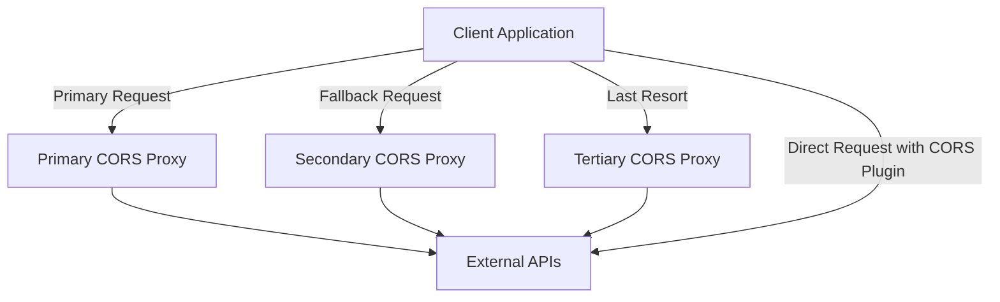

# Design Document: Public CORS Proxy Migration

## Overview

This design document outlines the approach for migrating the current CORS proxy functionality from Vercel and Supabase to public free proxy services. The solution will ensure that the application works correctly when deployed to GitHub Pages, maintaining all current functionality while eliminating dependencies on Vercel and Supabase for CORS handling.

## Architecture

The new architecture will replace the current server-side CORS proxy with a client-side solution that leverages multiple public CORS proxy services. The system will be designed with fallback mechanisms to ensure reliability.

### High-Level Architecture



## Components and Interfaces

### 1. CORS Proxy Service

This component will manage all proxy-related functionality:

```typescript
interface ProxyConfig {
  name: string;
  url: string;
  transformRequest?: (url: string) => string;
  headers?: Record<string, string>;
  supportsBinary?: boolean;
  priority: number;
}

interface ProxyResponse<T> {
  data: T | null;
  error: Error | null;
  source: string;
}

class CorsProxyService {
  private proxyConfigs: ProxyConfig[];
  private currentProxyIndex: number;
  
  constructor(configs: ProxyConfig[]);
  
  async fetch<T>(url: string, options?: RequestInit): Promise<ProxyResponse<T>>;
  private tryNextProxy<T>(url: string, options?: RequestInit, attempts?: number): Promise<ProxyResponse<T>>;
  private isProxyWorking(proxy: ProxyConfig): Promise<boolean>;
}
```

### 2. Proxy Configuration

The application will be configured with multiple public CORS proxy services:

```typescript
const proxyConfigs: ProxyConfig[] = [
  {
    name: 'corsproxy.io',
    url: 'https://corsproxy.io/?',
    transformRequest: (url) => `https://corsproxy.io/?${encodeURIComponent(url)}`,
    priority: 1
  },
  {
    name: 'cors-anywhere',
    url: 'https://cors-anywhere.herokuapp.com/',
    transformRequest: (url) => `https://cors-anywhere.herokuapp.com/${url}`,
    priority: 2
  },
  {
    name: 'allorigins',
    url: 'https://api.allorigins.win/raw?url=',
    transformRequest: (url) => `https://api.allorigins.win/raw?url=${encodeURIComponent(url)}`,
    priority: 3
  }
];
```

### 3. API Client

The API client will use the CORS proxy service to make requests:

```typescript
class ApiClient {
  private proxyService: CorsProxyService;
  
  constructor(proxyService: CorsProxyService);
  
  async get<T>(url: string, options?: RequestInit): Promise<T>;
  async post<T>(url: string, data: any, options?: RequestInit): Promise<T>;
  async put<T>(url: string, data: any, options?: RequestInit): Promise<T>;
  async delete<T>(url: string, options?: RequestInit): Promise<T>;
}
```

### 4. Notion API Client

A specialized client for Notion API requests:

```typescript
class NotionApiClient {
  private apiClient: ApiClient;
  private authToken: string;
  
  constructor(apiClient: ApiClient, authToken: string);
  
  async getDatabases(): Promise<any>;
  async getDatabase(databaseId: string): Promise<any>;
  async queryDatabase(databaseId: string, filter?: any): Promise<any>;
  // Other Notion API methods
}
```

## Data Models

No new data models are required for this feature. The existing data models will continue to work with the new proxy solution.

## Error Handling

The error handling strategy will include:

1. **Automatic Retry**: If a proxy service fails, the system will automatically try the next available proxy service.

2. **Error Reporting**: Clear error messages will be provided to users when all proxy services fail.

3. **Logging**: Failed proxy requests will be logged for debugging purposes.

4. **Fallback UI**: When all proxy services fail, the UI will display a helpful message with alternative solutions (like installing a CORS browser extension).

```typescript
try {
  const response = await proxyService.fetch(url, options);
  // Handle successful response
} catch (error) {
  // Log the error
  console.error('All proxy services failed:', error);
  
  // Show user-friendly error message
  showErrorNotification({
    title: 'Connection Error',
    message: 'Unable to connect to external services. Please try again later or consider using a CORS browser extension.',
    actions: [
      {
        label: 'Learn More',
        onClick: () => openCorsHelpDialog()
      }
    ]
  });
}
```

## Testing Strategy

### Unit Tests

1. Test each proxy service configuration individually
2. Test the fallback mechanism
3. Test error handling and retry logic

### Integration Tests

1. Test the complete flow from UI to proxy service to external API
2. Test with different content types (JSON, images, text)
3. Test with authenticated and unauthenticated requests

### Manual Tests

1. Deploy to GitHub Pages and verify all functionality works
2. Test with different browsers to ensure cross-browser compatibility
3. Test with different network conditions to verify fallback mechanisms

## Implementation Considerations

### Proxy Service Selection

The following public CORS proxy services have been evaluated:

1. **corsproxy.io**
   - Pros: Reliable, supports binary data, no rate limits
   - Cons: May have occasional downtime

2. **cors-anywhere.herokuapp.com**
   - Pros: Well-established, supports most request types
   - Cons: Rate limited, requires occasional refresh of demo access

3. **api.allorigins.win**
   - Pros: Simple to use, good for basic requests
   - Cons: Limited support for complex requests, may not forward all headers

4. **thingproxy.freeboard.io**
   - Pros: Simple and reliable for basic requests
   - Cons: Limited support for binary data

5. **crossorigin.me**
   - Pros: Easy to use
   - Cons: Unreliable uptime

Based on this evaluation, we will implement a solution that tries these services in order of reliability, with corsproxy.io as the primary option.

### Local Development

For local development, we will maintain the existing local proxy server as an option, but it will not be required for the application to function.

### Performance Considerations

Using public proxy services may introduce additional latency. To mitigate this:

1. We will implement caching for appropriate responses
2. We will use the fastest available proxy service as the primary option
3. We will provide clear loading indicators to improve perceived performance